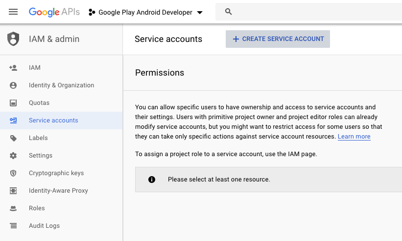
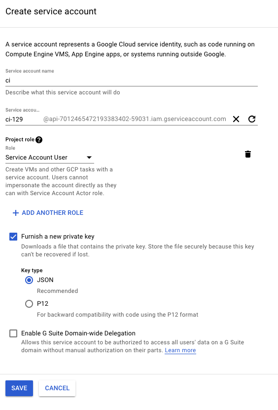

# Android Pipeline

[1 - Create Android application following Android Studio Wizard, 
 you may choose any prefered language (Android or Kotlin)](#creating-an-android-project)

[2 - Prepare unit tests layer](#basics-of-unit-testing)

[3 - Prepare UI tests layer](#basics-of-android-ui-testing)


# Manual Distribution with Google Play Store

[1 - Subscribe your application on Google Play Console](#application-subscription-on-google-play-console)

[2 - Prepare release distribution in Google Play Console](#google-play-release-distribution-preparation)

[3 - Generates a Key Store to Sign application](#generates-a-key-store-to-sign-application)

[4 - Distribute manually](#google-play-manual-release)

[5 - Manage testers](#google-play-manage-testers)


# Automated Distribution with Fastlane and Google Play Store

[1 - Subscribe your application on Google Play Console](#application-subscription-on-google-play-console)

[2 - Prepare release distribution in Google Play Console](#google-play-release-distribution-preparation)

[3 - Generates a Key Store to Sign application](#generates-a-key-store-to-sign-application)

[4 - Setup Google Play Console Service Account](#setup-google-play-console-service-account)

[5 - Prepares Gradle Release task with sign data for automated release](#prepares-gradle-release-task-with-sign-data-for-automated-release)

[6 - Setup fastlane](https://docs.fastlane.tools/getting-started/android/setup/)

[7 - Manage testers](#google-play-manage-testers)

## Generates a Key Store to Sign application

[1 - Generates a Key Store to sign the application](https://developer.android.com/studio/publish/app-signing)

2 - Store in a secure place the values below:
Store password, key alias and key password

3 - The generated KeyStore can be placed inside secret/ path of your application folder
As it is a sensitive data, add the following line inside .gitignore if you are under a Git repository:
```
secret/
```

## Setup Google Play Console Service Account

[1 - Setup a service account in Google Play Console](#google-play-console-service-account-setup)

2 - The service account JSON private key can be placed inside secret/ path of your application folder
As it is a sensitive data, add the following line inside .gitignore if you are under a Git repository:
```
secret/
```

## Prepares Gradle Release task with sign data for automated release

1 - Get release keys [from local.properties](#get-release-keys-from-local.properties)
or
[from environment variables](#get-release-keys-from-environment-variables)


## Get release keys from local.properties

1 - Store the KeyStore keys to local.properties file
```
RELEASE_STORE_FILE=../secret/cipipeline
RELEASE_STORE_PASSWORD=cipipepassword
RELEASE_KEY_ALIAS=cipipealias
RELEASE_KEY_PASSWORD=cipipepasswordkey
```

2 - As it is a sensitive data, add the following line inside .gitignore if you are under a Git repository:
```
local.properties
```

3 - Add these properties to signing and build type configurations in build.gradle file,
 in order to sign the application when the release task is called
```
Properties properties = new Properties()
properties.load(project.rootProject.file('local.properties').newDataInputStream())

signingConfigs {
        release {
            storeFile file(properties.RELEASE_STORE_FILE)
            storePassword properties.RELEASE_STORE_PASSWORD
            keyAlias properties.RELEASE_KEY_ALIAS
            keyPassword properties.RELEASE_KEY_PASSWORD
        }
    }

    buildTypes {
        release {
            signingConfig signingConfigs.release
        }
    }
```

## Get release keys from environment variables

1 - Open terminal and add the KeyStore keys to your computer environment variables
```
export CIPIPE_RELEASE_STORE_FILE=../secret/cipipeline
export CIPIPE_RELEASE_STORE_PASSWORD=cipipepassword
export CIPIPE_RELEASE_KEY_ALIAS=cipipealias
export CIPIPE_RELEASE_KEY_PASSWORD=cipipepasswordkey        
```

2 - Type env and check if the variables were properly added

3 - If you are under a Continuous Integration system, add them to its platform

4 - Add these properties to signing and build type configurations in build.gradle file,
 in order to sign the application when the release task is called
```
signingConfigs {
        release {
            storeFile file(System.env.CIPIPE_RELEASE_STORE_FILE)
            storePassword System.env.CIPIPE_RELEASE_STORE_PASSWORD
            keyAlias System.env.CIPIPE_RELEASE_KEY_ALIAS
            keyPassword System.env.CIPIPE_RELEASE_KEY_PASSWORD
        }
    }

    buildTypes {
        release {
            signingConfig signingConfigs.release
        }
    }
```

## Creating an Android project


## Basics of Build

1 - Run the Gradle build task: 
./gradlew build
 
## Basics of Unit Testing

1 - Open "ExampleUnitTest" file and make the test fail

 ```
 class ExampleUnitTest {
     @Test
     fun addition_isCorrect() {
         Assert.assertEquals(5, 2 + 2)
     }
 }
 ```

2 - Run the Gradle test task: 
./gradlew test

If there is some unit test failing it will appear in your console:

```
> Task :app:testDebugUnitTest FAILED

com.tw.pipeline.ExampleUnitTest > addition_isCorrect FAILED
    java.lang.AssertionError at ExampleUnitTest.kt:9

2 tests completed, 1 failed


FAILURE: Build failed with an exception.
```

3 - Fix the unit test that you have modified, and run the command again.
Just a Build Succeed will appear:

```
BUILD SUCCESSFUL in 5s
38 actionable tasks: 6 executed, 32 up-to-date
```

If you want to run your tests for only one build type (this can be important for a large test suite) you can use ./gradlew testDebug or ./gradlew testRelease.

5 - Open the generated reports:

When you run this task some tests reports are generated, it is placed in: 
"app/build/reports/tests/testDebugUnitTest/index.html"
"app/build/reports/tests/testReleaseUnitTest/index.html"


## Basics of Android UI testing

1 - Be connected with some Android device (real or emulator)

2 - Open "ExampleInstrumentedTest" file and make the test fail

 ```
@RunWith(AndroidJUnit4::class)
class ExampleInstrumentedTest {
    @Test
    fun useAppContext() {
        // Context of the app under test.
        val appContext = InstrumentationRegistry.getTargetContext()
        assertEquals("package.name.to.fail", appContext.packageName)
    }
}
 ```

3 - Run the Gradle test task: 
./gradlew connectedAndroidTest

If there is some unit test failing it will appear in your console:

```
Starting 1 tests on Nexus_5_API_27_PLAY(AVD) - 8.1.0ctedAndroidTest 

com.tw.pipeline.ExampleInstrumentedTest > useAppContext[Nexus_5_API_27_PLAY(AVD) - 8.1.0] FAILED 
        org.junit.ComparisonFailure: expected:<[different.name.of.packag]e> but was:<[com.tw.pipelin]e>
        at org.junit.Assert.assertEquals(Assert.java:115)
Starting 1 tests on Moto E (4) - 7.1.1

com.tw.pipeline.ExampleInstrumentedTest > useAppContext[Moto E (4) - 7.1.1] FAILED 
        org.junit.ComparisonFailure: expected:<[different.name.of.packag]e> but was:<[com.tw.pipelin]e>
        at org.junit.Assert.assertEquals(Assert.java:115)

FAILURE: Build failed with an exception.
```

4 - Fix the UI test that you have modified, and run the command again.
Just a Build Succeed will appear:

```
Starting 1 tests on Nexus_5_API_27_PLAY(AVD) - 8.1.0

BUILD SUCCESSFUL in 26s
52 actionable tasks: 1 executed, 51 up-to-date
```

If you want to run your tests for only one build type (this can be important for a large test suite) you can use ./gradlew connectedDebugAndroidTest or ./gradlew connectedReleaseAndroidTest.

5 - Open the generated reports:

When you run this task some tests reports are generated, it is placed in: 
"app/build/reports/androidTests/connected/index.html"


# Release

## Application subscription on Google Play Console

* Subscribe in [Google Developer Program](https://developers.google.com/programs/)

* Login on [Google Play Console](https://play.google.com/apps/publish)

* Create an Android application by following the images below:
 


## Google Play release distribution preparation

* In order to distribute your Android application, you should before set up some items on play store: App releases, Store Listing, Content Rating and Pricing and Distribution


# Extras

## Lint
If you want to analyze the source code with some lint tool, the Android Studio provides you a native solution thought Gradle.
It automatically generates reports and you can integrate this task in your pipeline to make your job fail when there is some
issue found. 

1 - ./gradlew lint

When you run this task some lint reports are generated, it is placed in: 
"/app/build/reports/lint-results.html"
"/app/build/reports/lint-results.xml"

If you want to break your build on any lint warning found. Just otu vaipen build.gradle file and add:
```
lintOptions {
    warningsAsErrors true   
}
```

## Google Play manual release

* Login on [Google Play Console](https://play.google.com/apps/publish)

* [Prepare your release on Google Play](#google-play-release-preparation)

* [Manage testers](#google-play-manage-testers)

* Generate a manual release by following the images below:
 


## Google Play manage testers


Distribute the opt-in url:


## Tester program acceptance

Access the opt-in url:


## Google Play Console Service Account setup







