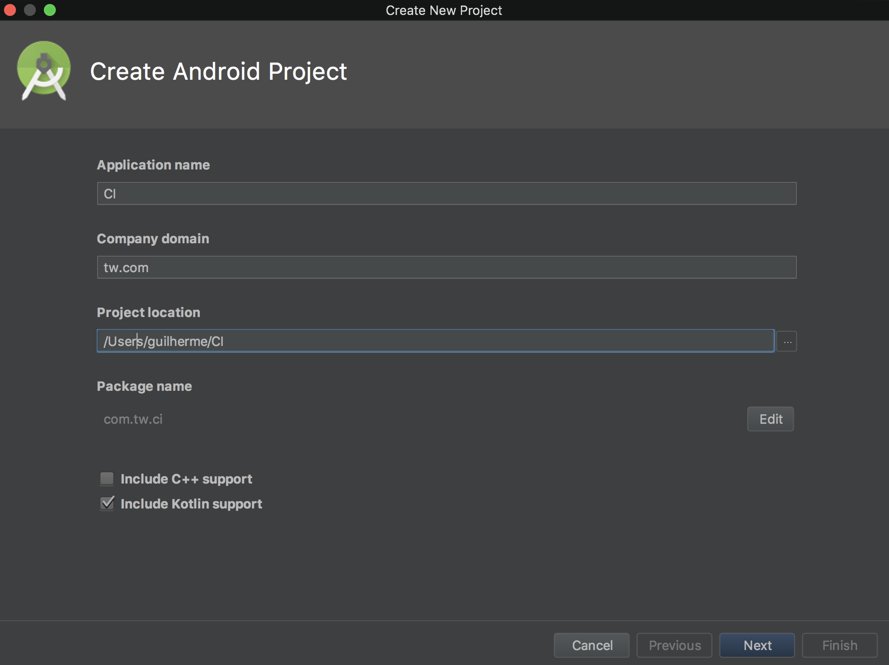

# Android Pipeline

[1 - Create Android application following Android Studio Wizard, 
 you may choose any prefered language (Android or Kotlin)](#creating-an-android-project)

[2 - Prepare unit tests layer](#basics-of-unit-testing)

[3 - Prepare UI tests layer](#basics-of-android-ui-testing)

[4 - Subscribe your application on Google Play Console](#application-subscription-on-google-play-console)


## Creating an Android project





## Basics of Build

1 - Run the Gradle build task: 
./gradlew build
 
## Basics of Unit Testing

1 - Open "ExampleUnitTest" file and make the test fail

 ```
 class ExampleUnitTest {
     @Test
     fun addition_isCorrect() {
         Assert.assertEquals(5, 2 + 2)
     }
 }
 ```

2 - Run the Gradle test task: 
./gradlew test

If there is some unit test failing it will appear in your console:

```
> Task :app:testDebugUnitTest FAILED

com.tw.pipeline.ExampleUnitTest > addition_isCorrect FAILED
    java.lang.AssertionError at ExampleUnitTest.kt:9

2 tests completed, 1 failed


FAILURE: Build failed with an exception.
```

3 - Fix the unit test that you have modified, and run the command again.
Just a Build Succeed will appear:

```
BUILD SUCCESSFUL in 5s
38 actionable tasks: 6 executed, 32 up-to-date
```

If you want to run your tests for only one build type (this can be important for a large test suite) you can use ./gradlew testDebug or ./gradlew testRelease.

5 - Open the generated reports:

When you run this task some tests reports are generated, it is placed in: 
"app/build/reports/tests/testDebugUnitTest/index.html"
"app/build/reports/tests/testReleaseUnitTest/index.html"


## Basics of Android UI testing

1 - Be connected with some Android device (real or emulator)

2 - Open "ExampleInstrumentedTest" file and make the test fail

 ```
@RunWith(AndroidJUnit4::class)
class ExampleInstrumentedTest {
    @Test
    fun useAppContext() {
        // Context of the app under test.
        val appContext = InstrumentationRegistry.getTargetContext()
        assertEquals("package.name.to.fail", appContext.packageName)
    }
}
 ```

3 - Run the Gradle test task: 
./gradlew connectedAndroidTest

If there is some unit test failing it will appear in your console:

```
Starting 1 tests on Nexus_5_API_27_PLAY(AVD) - 8.1.0ctedAndroidTest 

com.tw.pipeline.ExampleInstrumentedTest > useAppContext[Nexus_5_API_27_PLAY(AVD) - 8.1.0] FAILED 
        org.junit.ComparisonFailure: expected:<[different.name.of.packag]e> but was:<[com.tw.pipelin]e>
        at org.junit.Assert.assertEquals(Assert.java:115)
Starting 1 tests on Moto E (4) - 7.1.1

com.tw.pipeline.ExampleInstrumentedTest > useAppContext[Moto E (4) - 7.1.1] FAILED 
        org.junit.ComparisonFailure: expected:<[different.name.of.packag]e> but was:<[com.tw.pipelin]e>
        at org.junit.Assert.assertEquals(Assert.java:115)

FAILURE: Build failed with an exception.
```

4 - Fix the UI test that you have modified, and run the command again.
Just a Build Succeed will appear:

```
Starting 1 tests on Nexus_5_API_27_PLAY(AVD) - 8.1.0

BUILD SUCCESSFUL in 26s
52 actionable tasks: 1 executed, 51 up-to-date
```

If you want to run your tests for only one build type (this can be important for a large test suite) you can use ./gradlew connectedDebugAndroidTest or ./gradlew connectedReleaseAndroidTest.

5 - Open the generated reports:

When you run this task some tests reports are generated, it is placed in: 
"app/build/reports/androidTests/connected/index.html"


# Release

## Application subscription on Google Play Console

* Subscribe in [Google Developer Program](https://developers.google.com/programs/)

* Login on [Google Play Console](https://play.google.com/apps/publish)

* Create an Android application by following the images below:
 


## Google Play release preparation

* In order to distribute your Android application, you should before set up some items on play store: App releases, Store Listing, Content Rating and Pricing and Distribution


## Crashlytics Beta Distribution

Lorem Ipsum is simply dummy text of the printing and typesetting industry. Lorem Ipsum has been the industry's standard dummy text ever since the 1500s, when an unknown printer took a galley of type and scrambled it to make a type specimen book. It has survived not only five centuries, but also the leap into electronic typesetting, remaining essentially unchanged. It was popularised in the 1960s with the release of Letraset sheets containing Lorem Ipsum passages, and more recently with desktop publishing software like Aldus PageMaker including versions of Lorem Ipsum.

## Fastlane 

Lorem Ipsum is simply dummy text of the printing and typesetting industry. Lorem Ipsum has been the industry's standard dummy text ever since the 1500s, when an unknown printer took a galley of type and scrambled it to make a type specimen book. It has survived not only five centuries, but also the leap into electronic typesetting, remaining essentially unchanged. It was popularised in the 1960s with the release of Letraset sheets containing Lorem Ipsum passages, and more recently with desktop publishing software like Aldus PageMaker including versions of Lorem Ipsum.


# Extras

## Lint
If you want to analyze the source code with some lint tool, the Android Studio provides you a native solution thought Gradle.
It automatically generates reports and you can integrate this task in your pipeline to make your job fail when there is some
issue found. 

1 - ./gradlew lint

When you run this task some lint reports are generated, it is placed in: 
"/app/build/reports/lint-results.html"
"/app/build/reports/lint-results.xml"

If you want to break your build on any lint warning found. Just otu vaipen build.gradle file and add:
```
lintOptions {
    warningsAsErrors true   
}
```

## Code Format
Lorem Ipsum is simply dummy text of the printing and typesetting industry. Lorem Ipsum has been the industry's standard dummy text ever since the 1500s, when an unknown printer took a galley of type and scrambled it to make a type specimen book. It has survived not only five centuries, but also the leap into electronic typesetting, remaining essentially unchanged. It was popularised in the 1960s with the release of Letraset sheets containing Lorem Ipsum passages, and more recently with desktop publishing software like Aldus PageMaker including versions of Lorem Ipsum.

## Google Play manual release

* Login on [Google Play Console](https://play.google.com/apps/publish)

* [Prepare your release on Google Play](#google-play-release-preparation)

* [Manage testers](#google-play-manage-testers)

* Generate a manual release by following the images below:
 


## Google Play manage testers


Distribute the opt-in url:


## Tester program acceptance

Access the opt-in url:


